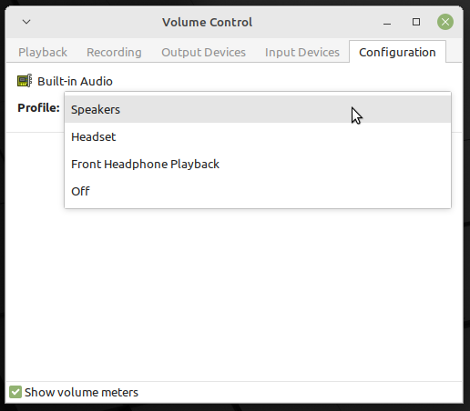

# Fixing sklnau8825max audio for Linux

### This guide will present ways of getting the sklnau8825max sound card to work under the mainline Linux kernel

## Supported devices

### Tested and working:
- Acer Chromebook 14 for Work (CP5-471) (codename: LARS)

### Should work but not tested:
- Acer Chromebook 11 (C771, C771T) (codename: LARS)
- ASUS Chromebook Flip C302 (codename: CAVE)
- other chromebooks with sklnau8825max sound card

## Supported operating systems

### Tested and working:
- Ubuntu 20.04 and derivatives (Linux Mint 20.x)

### Tested and not working:
- Ubuntu 22.04
- Debian 11

## Guide

### Prerequisites:
- supported chromebook
- Internet connection
- basic command line knowledge

### Firmware installation
Install [MrChromebox's UEFI firmware](https://mrchromebox.tech/) on your device.
<br>Warning!
<br>This will void your warranty and may brick your device!

### OS installation
Normally install one of supported operating systems. Nothing fancy here.

### 1st way - fast and insecure
> #### 1. Clone the repository and enter it
> ```
> git clone https://github.com/PiotrZPL/sklnau8825max-on-linux.git
> cd sklnau8825max-on-linux
> ```
> #### 2. Run the script with root privileges
> ```
> sudo ./script.sh
> ```
> #### 3. Reboot

### 2nd way - slower and still insecure
> #### 1. Clone the repository and enter it
> ```
> git clone https://github.com/PiotrZPL/sklnau8825max-on-linux.git
> cd sklnau8825max-on-linux
> ```
> #### 2. Install required packages
> ```
> sudo dpkg -i ./debs/*.deb
> ```
> It is the step that makes this way insecure. You should not install random kernels from the Internet.
> #### 3. Point intel-hda-snd at old firmware and ensure it doesn't get switched back
> ```
> sudo ln -sf /lib/firmware/intel/dsp_fw_release_v969.bin /lib/firmware/intel/dsp_fw_release.bin
> sudo install ./fs/etc/apt/apt.conf.d/98old-firmware /etc/apt/apt.conf.d/98old-firmware
> ```
> #### 4. Copy the topology file. It is based on `src/skl_n88l25_m98357a-tplg`
> ```
> sudo cp ./fs/lib/firmware/skl_n88l25_m98357a-tplg.bin /lib/firmware/
> ```
> #### 5. Copy the alsa configuration files and give them appropriate permissions
> ```
> sudo cp -r ./fs/usr/share/alsa/ucm2/sklnau8825max /usr/share/alsa/ucm2/
> sudo chmod -R +r /usr/share/alsa/ucm2/sklnau8825max
> ```
> #### 6. Copy event listeners and give them appropriate permissions
> ```
> sudo cp ./fs/etc/acpi/events/* /etc/acpi/events/
> sudo chmod +r /etc/acpi/events/{plugheadphone,plugheadset,unplugheadphone}
> ```
> #### 7. Reboot

### 3rd way - requiring a lot of time but secure
> #### 1. Clone the repository and enter it
> ```
> git clone https://github.com/PiotrZPL/sklnau8825max-on-linux.git
> cd sklnau8825max-on-linux
> ```
> #### 2. Install kernel build dependencies
> ```
> sudo apt install libc6-dev ncurses-dev gcc make binutils elfutils flex bison devscripts libssl-dev python-pytest
> ```
> #### 3. Download Linux kernel 5.10.x from [here](kernel.org) and verify your checksum
> #### 4. Unpack kernel (replace ```x``` with your kernel version)
> ```
> tar -Jxvf linux-5.10.x.tar.xz
> ```
> #### 5. Copy the config file from the repository
> ```
> cp src/kernel-config linux-5.10.x/.config
> ```
> #### 6. Build the kernel from source
> ```
> cd linux-5.10.x
> make oldconfig
> make testconfig
> make -j2 bindeb-pkg
> ```
> This step will take a lot of time on a chromebook. Consider doing it on a more powerful computer and copying files to your chromebook.
> #### 7. Install created packages
> ```
> cd ..
> sudo dpkg -i ./*.deb
> ```
> #### 8. Follow 2nd way from the 3rd step

## Troubleshooting
If, after rebooting, the audio still does not work, go to your audio mixer/volume control and open `Configuration` tab. From there, find `Built-in Audio` and change your profile to `Speakers`.
<br>

<br>
If your audio still does not work, [open an issue in this repository](https://github.com/PiotrZPL/sklnau8825max-on-linux/issues/new) and describe your problem.

## Credits
The creation of this repository would not have been possible without:
- [devendor](https://github.com/devendor/c302ca)
- [MrChromebox](https://mrchromebox.tech/)
- [Galliumos Project](https://galliumos.org/)